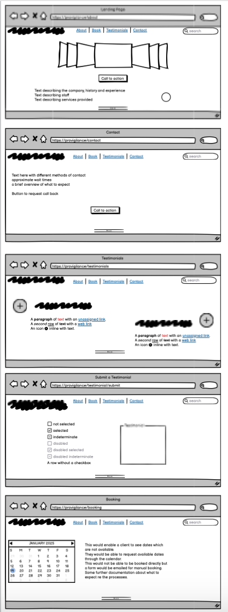
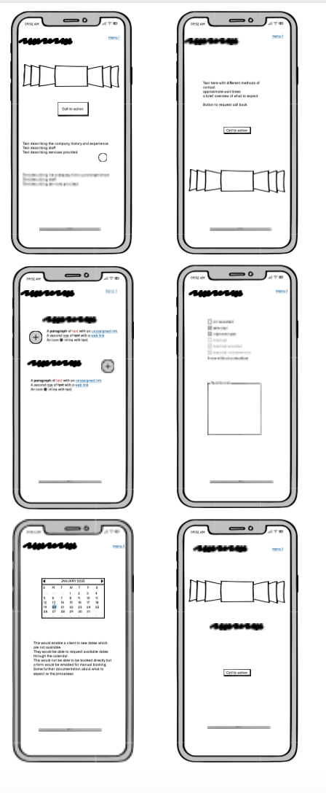
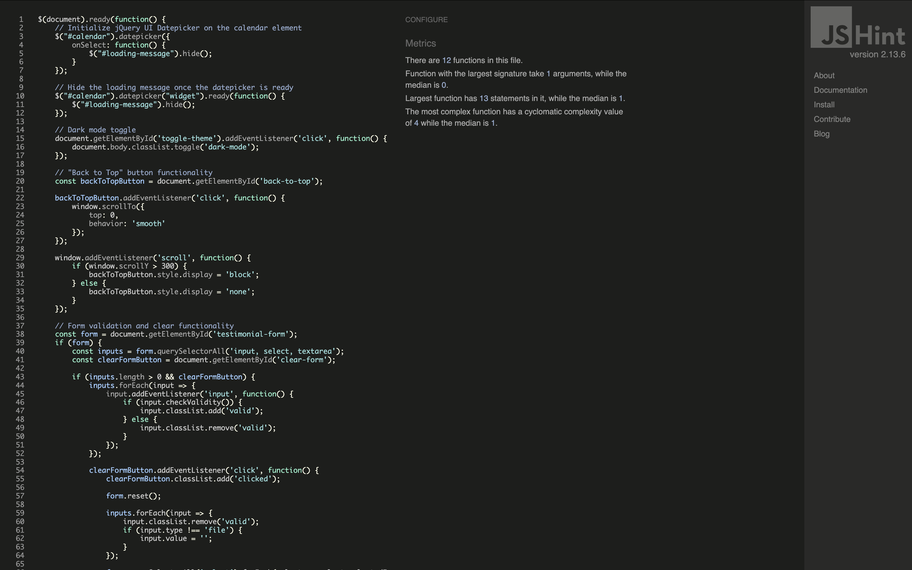

[![Contributors][contributors-shield]](https://github.com/jesskins/provigilance/graphs/contributors)
[![Issues][issues-shield]](https://github.com/jesskins/provigilance/issues)
[![License][license-shield]](https://github.com/jesskins/provigilance/blob/main/license.txt)
[![LinkedIn][linkedin-shield]](https://www.linkedin.com/in/jessbhowkins)

<!-- Shields.io badge definitions -->
[contributors-shield]: https://img.shields.io/github/contributors/jesskins/provigilance.svg
[issues-shield]: https://img.shields.io/github/issues/jesskins/provigilance.svg
[license-shield]: https://img.shields.io/github/license/jesskins/provigilance.svg
[linkedin-shield]: https://img.shields.io/badge/-LinkedIn-blue

  <h3 align="center">Provigilance</h3>

  

    A webpage for the pre-existing buisness, to enhance business aquesition and promote new client sign-ups. 
     
    <a href="https://github.com/jesskins/provigilance"><strong>Explore the docs »</strong></a>

<!-- TABLE OF CONTENTS -->

  
Table of Contents

  <ol>
    <li>
      <a href="#about-the-project">About The Project</a>
      <ul>
        <li><a href="#built-with">Built With</a></li>
      </ul>
    </li>
    <li>
      <a href="#getting-started">Getting Started</a>
      <ul>
        <li><a href="#prerequisites">Prerequisites</a></li>
        <li><a href="#installation">Installation</a></li>
      </ul>
    </li>
    <li><a href="#usage">Usage</a></li>
    <li><a href="#roadmap">Roadmap</a></li>
    <li>
      <a href="#documentation">Documentation</a>
      <ul>
        <li><a href="#user-stories">User Stories</a></li>
        <li><a href="#key-features">Key Features</a></li>
      </ul>
    </li>
    <li><a href="#testing-and-validation">Testing and Validation</a></li>
    <li><a href="#debugging">Debugging</a></li>
    <li><a href="#ai-overview">An overview of artificial intelligence use in this project</a></li>
    <li><a href="#contributing">Contributing</a></li>
    <li><a href="#license">License</a></li>
    <li><a href="#contact">Contact</a></li>
    <li><a href="#acknowledgments">Acknowledgments</a></li>
  </ol>

<!-- ABOUT THE PROJECT -->
## About The Project

[![Product Name Screen Shot][product-screenshot]](https://example.com)

Provigilance is designed to provide top-notch security for your data. Our application offers comprehensive monitoring and alerting features to keep your information safe. Here's why Provigilance stands out:
* Focuses on providing exceptional data security.
* Easy to set up and use, so you can focus on what matters.
* Continuously updated to address the latest security threats.

We'll keep adding more features to meet your evolving needs. Feel free to suggest changes by forking this repo and creating a pull request or opening an issue. Thanks to all contributors!

(<a href="#readme-top">back to top</a>)

### Built With

This section lists the major frameworks/libraries used to build Provigilance:

* [![Django][Django]](https://www.djangoproject.com/) - A high-level Python web framework
* [![Django OAuth Toolkit][Django-OAuth-Toolkit]](https://django-oauth-toolkit.readthedocs.io/en/latest/) - OAuth2 provider implementation for Django
* [![Gunicorn][Gunicorn]](https://gunicorn.org/) - Python WSGI HTTP Server for UNIX
* [![Pillow][Pillow]](https://python-pillow.github.io/) - Python Imaging Library (Fork)
* [![psycopg2][psycopg2]](https://www.psycopg.org/) - PostgreSQL adapter for Python
* [![python-dotenv][python-dotenv]](https://saurabh-kumar.com/python-dotenv/) - Manage environment variables
* [![Whitenoise][Whitenoise]](http://whitenoise.evans.io/en/stable/) - Serve static files directly from your Python web app
* [![Google Auth][Google-Auth]](https://google-auth.readthedocs.io/en/latest/) - Google's library for using OAuth 2.0 and OpenID Connect

(<a href="#readme-top">back to top</a>)

## Documentation

#### Wireframes

Wireframes were created in Balsamiq to give an approximate idea for the design and features to include. In this project, one of the goals is to meet a more flexible and dynamic working style, and avoid the tendancy to fixate on a specific element which is untimately not that valuable to the MVP. Therefore the wireframes were to serve as a guide, rather than a strict instruction. 
  
  
  

**Reasoning for Changes:**
- **Initial Concept:** 
  - To build a website which was 
- **Feedback and Revisions:**
  - Document any feedback received and changes made based on that feedback.
- **Final Design:**
  - Provide a summary of the final design and why certain decisions were made.

### User Stories
[Link To Project Board](https://github.com/users/jesskins/projects/7)

#### AI Reflection:

User stories were created with the assistance of AI in initial generation, they were then ammended and edited to align with the project goals and values relevant for this project. For this project, AI had a difficult time understanding the project scope, as the buisness goals are outside of a classic "QA Audit", therefore AI's continubution was excellent for the more generic user stories, but lacking to assist with industry specific. 

#### Additional labels 
The classic "must", "should" and "could" labels were utilised for organisation. To help prevent wasted time on less important issues, the label "design bug" was also used for areas where the design was not meeting expectation, but should not affect MVP (i.e., low priority).
Following the design plan, I intended to only work on the "coulds" once the MVP was met (Musts), while monitoring if some had been completed serentipitously. 

**Design Rationale:**
- Explain the design decisions made throughout the project.
  - Choice of color scheme, typography, and layout.
  - Interaction and navigation design.
  - Accessibility considerations.

Strategic concessions and resouce allocations 

- Footer TrustPilot button - as trustpilot require a buisness accound with them to use their widgets a tempoary button was created as a filler, which will be updated to one of their widgets with the next update. 
Copilot was especially helpful to match the chosen font to trustpilot's brand font, saved many many minutes. 

**Final Implementation:**
- Describe the final implementation of the project.
  - Key features and functionalities.
  - How the design is brought to life in the final product.
  - Any technical constraints or challenges overcome.

### Key Features 

#### Pages

Book

The booking page is ideally going to serve as a request appointment form, to display to potential clients availability over the coming 12 months. Utimately, being able to directly book from the website is impractical, as due to the service type extensive communication is required to work out the correct package required for the client. 
In the interest of passing the CRUD functionality for the assessment, this has been adapted into a more typical booking system with the intention of being drawn back at a later release. 
Instruction from [dev genius](https://blog.devgenius.io/django-tutorial-on-how-to-create-a-booking-system-for-a-health-clinic-9b1920fc2b78) was utilised to create this page. 

(<a href="#readme-top">back to top</a>)

Submission Success - booking, request call back and testimonial submission. 

Following the successful submission of one for the website forms the user should be sent an email confirming their submission. 
To make this operational, I set up a new email for the testing phase to ensure no errors or addtional faff to the current, operational business email address. 
Initially, I attempted to set this up directly with google via Google Cloud. However, due to recent more rigerous [privacy restrictions](https://cloud.google.com/endpoints/docs/openapi/serving-apis-from-domains) I was unable to do meet their privacy criteria - namely having a secure and top level domain. 
Therefore, a "middle-man" software, [Brevo ("SendinBlue")](https://www.brevo.com/) was used to ensure emails were sent despite not meeting Google Cloud's required secutrity. 
In the future, I would intend to remove this service and directly manage this function, once the website is up and running, and able to meet the privacy/secutiry measures. 

#### CRUD Functionality 

The Django Admin interface was implemented to meet requirements to add, edit, delete and read submitted testimonials and booking requests. 

## Testing and Validation 

### Manual Testing

- **User Testing:**
  - User testing was performed little and often during development to ensure the functionality and design was being conveyed correctly. 
- Other users were recruited to make suggestions regarding design features and usability. 

### Validation

Provide links to validation tools used.

- **HTML Validation:**
  - [W3C Markup Validation Service](https://validator.w3.org/)
  - No errors or warnings were found in style.css.
  [!Valdiation result](assets/readme/cssvalidation.png)
- **CSS Validation:**
  - [W3C CSS Validation Service](https://jigsaw.w3.org/css-validator/)
   - No errors or warnings were found in style.css.
  [!Valdiation result](assets/readme/cssvalidation.png)
- **Accessibility Validation:**
  - [WAVE Web Accessibility Evaluation Tool](https://wave.webaim.org/)
  - No errors, some points to be amended but nothing urgent. 
  [!Wave Result](assets/readme/waveaccessibility.png)
  - [Color Contrast Checker](https://webaim.org/resources/contrastchecker/)
  - Generally the webpage didn't use that much colour and stuck to off white and greys, with some bright blues/light bright blues which changed depending on the foreground/background for contrast.
  [!Colour contrast results](assets/readme/contrastresults.png)

#### Python
- **Linting and Formatting:**
  - Tools used: pycodestyle
  - Command: `pycodestyle`
  - The installable pyhton tool [pycodestyle](https://pypi.org/project/pycodestyle/) (previously called pep8) was used to validate the python code in the terminal during development. Please see the example screen shot below. This was recommended from [this source](https://www.reddit.com/r/learnpython/comments/3riq4k/tool_for_checking_if_your_code_is/). Errors where ammended, I decided to keep lines below the recommended 79 characters to help to manage multiple tabs open, any errors which I did not understand I used copilot to explain in plain English, or searched the error on [stack overflow](https://stackoverflow.com/questions/53158284/python-giving-a-e501-line-too-long-error). 
  [!pycodestyle python linting](assets/readme/images/pycodestyleex.png)

#### JavaScript
- **Linting and Formatting:**
  - Tools used: [JSHint](https://jshint.com/)
  - Web Tool used.
  - 
  I copied over all relevant JavaScript files to JSHint to check for any errors. All errors were amended. Unfortunately, in bundle.js there were several warnings present (20 to be exact). Due to time constraints, and minimal affect to functionality these were left for a future bug fix.

(<a href="#readme-top">back to top</a>)

## Debugging 

AI was used to assist in debugging code. 

Additionally, external resources such as stack overflow was used to help debug issues, especially in relation to failure of JQueries. [Please see here](https://stackoverflow.com/questions/33998262/jquery-ui-and-webpack-how-to-manage-it-into-module/39230057#39230057)

## An overview of artificial intellegence use in this project

- AI was also used to help add comments and missing aria-labels, to meet PEP8 guidelines. While the comments may be a little janky, they provided a useful promt for me to write over in my own words to better understand when coming to review. AI was very helpful in providing the base template for the aria labels which I could then amend, hence proving to be a great time saver. 

- AI was an excellent organisational tool for arduous tasks, for example AI was able to compare my project to the mark scheme and present an action plan to implement these, to meet MVP for the assessment criteria. 
[Please see this doc for examples](https://docs.google.com/document/d/16haXEoKpJzboay5zRGtMt_Hq5ZxSdGOp9jV-yURNXYQ/edit?pli=1&tab=t.0#heading=h.dden1mj8cyor)

## Contributing

Contributions are what make the open source community such an amazing place to learn, inspire, and create. Any contributions you make are **greatly appreciated**.

1. Fork the Project
2. Create your Feature Branch (`git checkout -b feature/AmazingFeature`)
3. Commit your Changes (`git commit -m 'Add some AmazingFeature'`)
4. Push to the Branch (`git push origin feature/AmazingFeature`)
5. Open a Pull Request

## License

Distributed under the Unlicense License. See `LICENSE.txt` for more information.

(<a href="#readme-top">back to top</a>)

## Contact

Project Link: [https://github.com/jesskins/provigilance](https://github.com/jesskins/provigilance)

(<a href="#readme-top">back to top</a>)

## Acknowledgments

Thank you so much everyone for your help !! I have left this very last minute but everyone I asked for help was so lovely about it appreciate you all. 

Sources etc:

* [Choose an Open Source License](https://choosealicense.com)
* [Img Shields](https://shields.io)
* [GitHub Pages](https://pages.github.com)
* [Font Awesome](https://fontawesome.com)
* [React Icons](https://react-icons.github.io/react-icons/search)
* [Dev Genius Calendar Iplementation](https://blog.devgenius.io/django-tutorial-on-how-to-create-a-booking-system-for-a-health-clinic-9b1920fc2b78)

(<a href="#readme-top">back to top</a>)

<!-- MARKDOWN LINKS & IMAGES -->
[contributors-shield]: https://img.shields.io/github/contributors/othneildrew/Best-README-Template.svg?style=for-the-badge
[contributors-url]: https://github.com/othneildrew/Best-README-Template/graphs/contributors
[forks-shield]: https://img.shields.io/github/forks/othneildrew/Best-README-Template.svg?style=for-the-badge
[forks-url]: https://github.com/othneildrew/Best-README-Template/network/members
[stars-shield]: https://img.shields.io/github/stars/othneildrew/Best-README-Template.svg?style=for-the-badge
[stars-url]: https://github.com/othneildrew/Best-README-Template/stargazers
[issues-shield]: https://img.shields.io/github/issues/othneildrew/Best-README-Template.svg?style=for-the-badge
[issues-url]: https://github.com/othneildrew/Best-README-Template/issues
[license-shield]: https://img.shields.io/github/license/othneildrew/Best-README-Template.svg?style=for-the-badge
[license-url]: https://github.com/othneildrew/Best-README-Template/blob/master/LICENSE.txt
[linkedin-shield]: https://img.shields.io/badge/-LinkedIn-black.svg?style=for-the-badge&logo=linkedin&colorB=555
[linkedin-url]: https://linkedin.com/in/othneildrew
[product-screenshot]: images/screenshot.png
[Next.js]: https://img.shields.io/badge/next.js-000000?style=for-the-badge&logo=nextdotjs&logoColor=white
[Next-url]: https://nextjs.org/
[React.js]: https://img.shields.io/badge/React-20232A?style=for-the-badge&logo=react&logoColor=61DAFB
[Vue.js]: https://img.shields.io/badge/Vue.js-35495E?style=for-the-badge&logo=vuedotjs&logoColor=4FC08
[Angular.io]: https://img.shields.io/badge/Angular-DD0031?style=for-the-badge&logo=angular&logoColor=white
[Angular-url]: https://angular.io/
[Svelte.dev]: https://img.shields.io/badge/Svelte-4A4A55?style=for-the-badge&logo=svelte&logoColor=FF3E00
[Svelte-url]: https://svelte.dev/
[Laravel.com]: https://img.shields.io/badge/Laravel-FF2D20?style=for-the-badge&logo=laravel&logoColor=white
[Laravel-url]: https://laravel.com
[Bootstrap.com]: https://img.shields.io/badge/Bootstrap-563D7C?style=for-the-badge&logo=bootstrap&logoColor=white
[Bootstrap-url]: https://getbootstrap.com
[JQuery.com]: https://img.shields.io/badge/jQuery-0769AD?style=for-the-badge&logo=jquery&logoColor=white
[JQuery-url]: https://jquery.com 
<!-- MARKDOWN LINKS & IMAGES -->
[Django]: https://img.shields.io/badge/Django-092E20?style=for-the-badge&logo=django&logoColor=white
[Django-OAuth-Toolkit]: https://img.shields.io/badge/Django%20OAuth%20Toolkit-092E20?style=for-the-badge
[Gunicorn]: https://img.shields.io/badge/Gunicorn-499848?style=for-the-badge&logo=gunicorn&logoColor=white
[Pillow]: https://img.shields.io/badge/Pillow-499848?style=for-the-badge&logo=pillow&logoColor=white
[psycopg2]: https://img.shields.io/badge/psycopg2-336791?style=for-the-badge
[python-dotenv]: https://img.shields.io/badge/python--dotenv-3670A0?style=for-the-badge&logo=python&logoColor=ffdd54
[Whitenoise]: https://img.shields.io/badge/Whitenoise-003C7E?style=for-the-badge
[Google-Auth]: https://img.shields.io/badge/Google%20Auth-4285F4?style=for-the-badge&logo=google&logoColor=white
